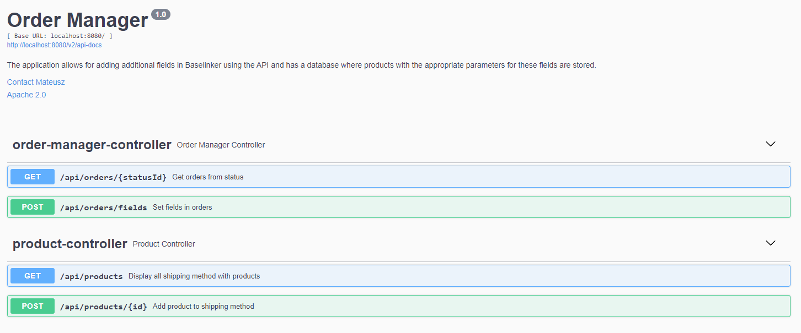
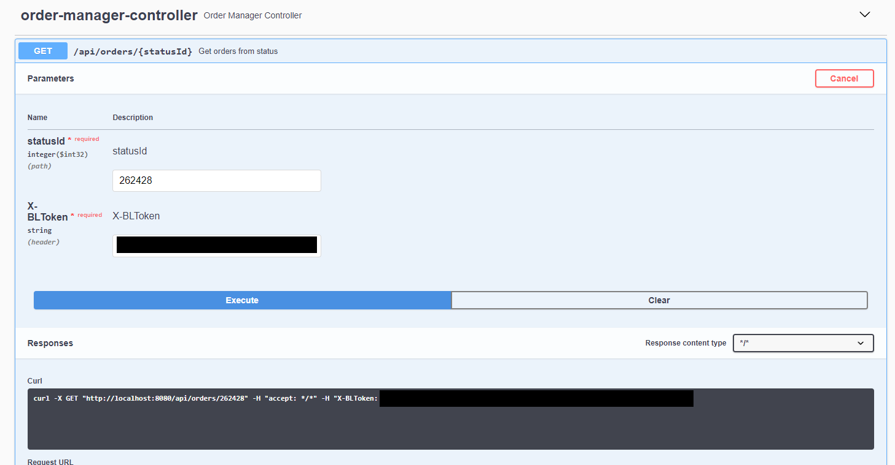
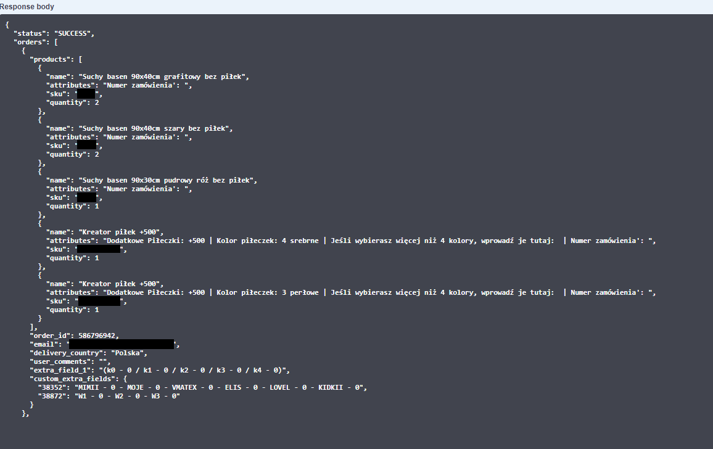
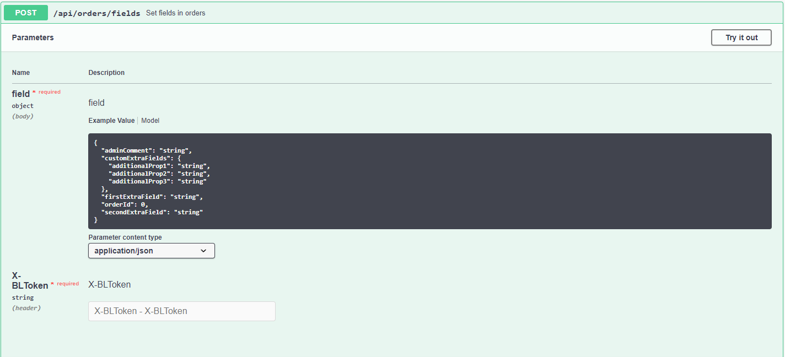
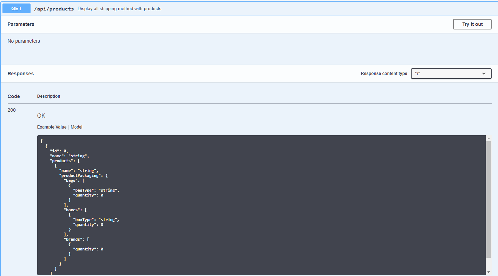
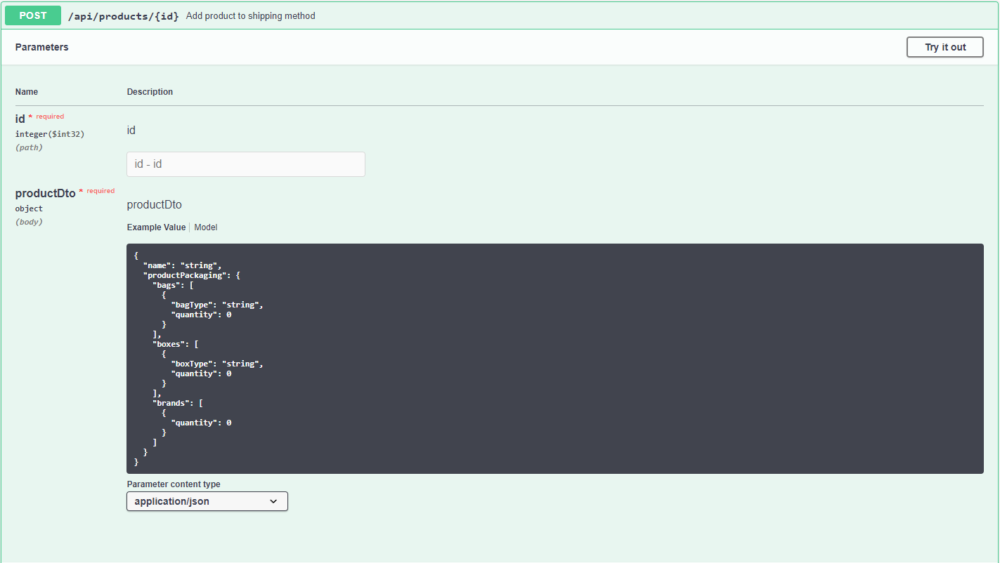

<h1>Order Manager</h1>

<h3>PL</h3>
<b>Order Manager - to aplikacja stworzona w Javie z wykorzystaniem Spring Boot i Hibernate. Dzięki integracji z API Baselinkera, aplikacja znacząco przyspiesza i upraszcza proces wypełniania kart zamówień. Aplikacja w połączeniu z częścią frontendową w intuicyjny sposób umożliwia użytkownikom przejrzyste wypełnianie wymaganych pól.</b>

<b>Technologie:
- Java
- Spring
- Hibernate
- H2
- Postgres
- JUnit
- Mockito
- Docker
- REST
  </b>

<h3>ENG</h3>
<b>Order Manager is an application developed in Java using Spring Boot and Hibernate. Thanks to its integration with the Baselinker API, the application significantly speeds up and simplifies the process of filling out order forms. When paired with its frontend component, the application allows users to intuitively fill out the required fields in a clear manner.production environment.</b>

<b>Technology:
- Java
- Spring
- Hibernate
- H2
- Postgres
- JUnit
- Mockito
- Docker
- REST
  </b>


<br></br>
<b>Swagger:</b>
```
/swagger-ui/index.html#
```
<br></br>
<b>Order:</b>

|   Method    |        Url         |         Descritpion         |
|:-----------:|:------------------:|:---------------------------:|
| <b>GET</b>  | /orders/{statusId} | Display orders from status  |
| <b>POST</b> |   /orders/fields   | Add new data to order field |


<br></br>
<b>Product:</b>

|   Method    |      Url       |                Descritpion                |
|:-----------:|:--------------:|:-----------------------------------------:|
| <b>GET</b>  |   /products    | Display all shipping method with products |
| <b>POST</b> | /products/{id} |      Add products to shipping method      |


<br></br>
<b>Images:</b>











